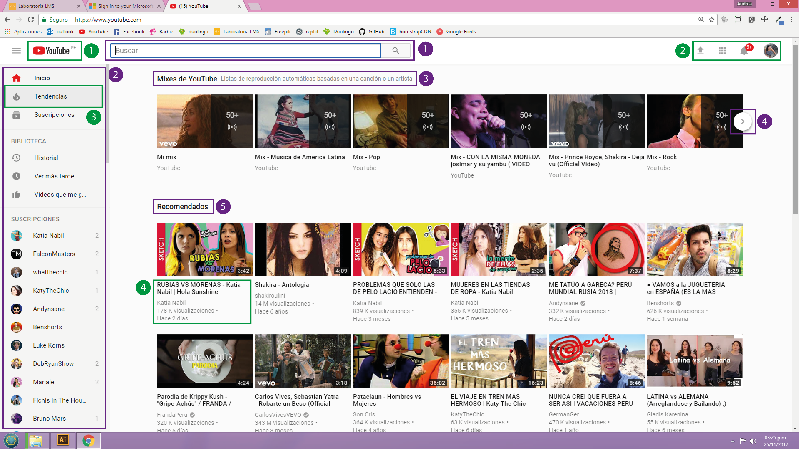
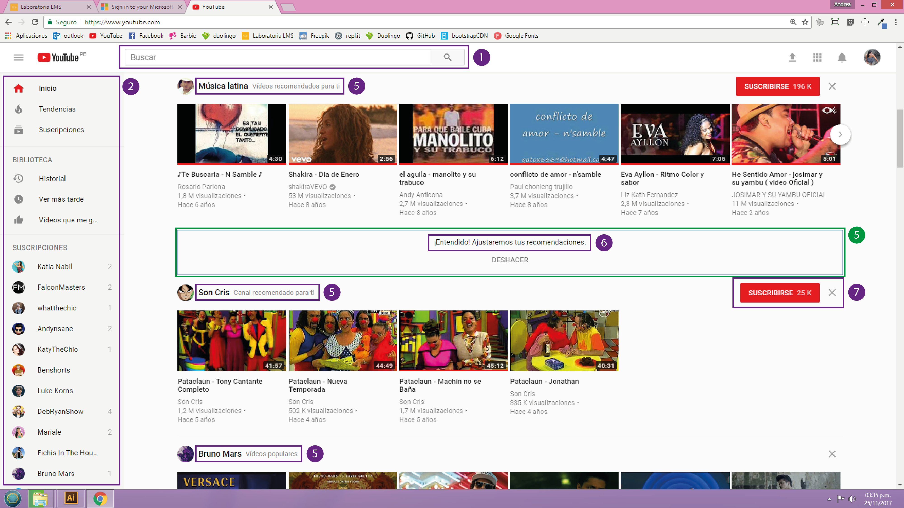
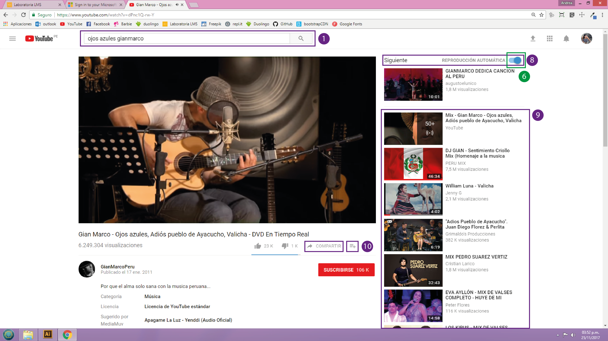

# YOU TUBE
### ¿Qué parte es UX y que parte UI?

#### UX
1.	La barra de búsqueda es una de las primeras cosas que el usuario puede ver, ya que muchos ingresan a la página con una idea clara de lo que quieren buscar.
2.	Una barra visible que muestra las opciones más solicitadas, así como los canales a los que estas suscrito.
3.	Mixes de YouTube: listas de reproducción basadas en los videos de música que más reproduce el usuario.
4.	La lista de mix de YouTube se muestra en una sola fila, lo cual hace más fácil que el usuario pueda solo pasarla.
5.	Recomendados: te da una lista de videos recomendados según aquellos videos o canales visitados últimamente.
#### UI
1.	Que toda la página siga el manual de estilos del logo.(colores, tipografía etc).
2.	Los colores y estilos de los botones.
3.	Hover del menú lateral.
4.	Los estilos de organización de la información de los videos.

#### UX
5.	Recomendados: te da una lista de videos recomendados según aquellos videos o canales visitados últimamente.
6.	Al cerrar una sección de recomendación ajusta lo que muestra ocultando el contenido y tomándolo en cuenta en las siguientes visitas.
7.	Muestra un botón para suscribirse a aquellos canales que el usuario visita constantemente.
#### UI
5.	La forma en la que se muestra el mensaje para ajustar recomendaciones.

#### UX
8.	Reproducción automática: ejecuta un video relacionado al actual, además incluye un pequeño botón con el cual puedes activar o desactivar la reproducción automática.
9.	Recomendaciones en base al video que está reproduciéndose.
10.	Botones para compartir y ver más tarde.
#### UI
6.	Estilo y color del botón de reproducción automática.